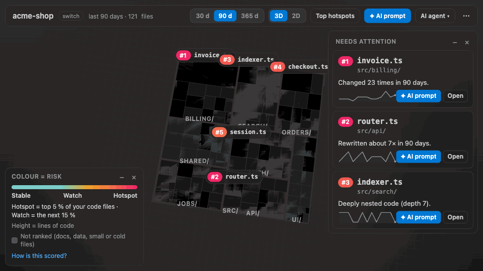
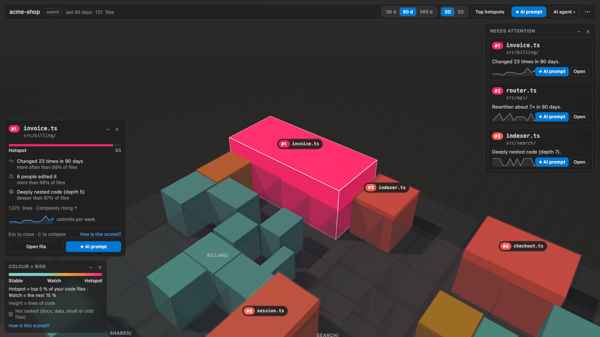
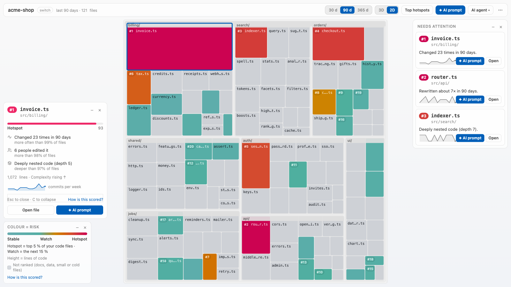

# Churnmap: Code Hotspots City

**Churnmap reads your git history and shows your repository as a 3D city, so the files that
change most and hurt most, your code hotspots, glow and explain themselves.**

- See the 5 files that cause most of your trouble, in 10 seconds.
- Every hotspot explains itself in plain words: "Changed 29 times in 90 days", "Rewritten about
  2× in 90 days", "6 people edited it".
- Works with your AI agent: ready-to-paste AI prompts, an agent context file and a local MCP
  server your agent calls instead of running `git log` itself.
- Runs entirely on your machine. Zero telemetry, no account.

## Quick start

1. Install Churnmap from the
   [Visual Studio Marketplace](https://marketplace.visualstudio.com/items?itemName=Indrasol.churnmap)
   or [Open VSX](https://open-vsx.org/extension/Indrasol/churnmap).
2. Open a folder that is a git repository (and trust it when VS Code asks).
3. Run **Churnmap: Build city** from the Command Palette. The city opens, and the ranked list
   appears in the Churnmap side bar.

No configuration, no sign-in. The only requirement is `git` on your `PATH`.

## Features

**The city (3D and 2D).** Folders are districts, files are buildings: height is lines of code,
colour is the hotspot band, and the top 20 glow. Point at a building for its card; click it to
select it (the camera flies there and its card stays open with **Open file**, **✦ AI prompt** and
_How is this scored?_), and double-click to open the file. The selected card never gets in the
way: close it with **×**, collapse it to a small pill with **–** (or `C`), or drag it by its
header to any corner; the "Needs attention" rail and the legend move, collapse and close the same
way, and Churnmap remembers where you put them. Press `2` to morph the city into a flat 2D
treemap of the same layout. **✦ AI prompt** and the **AI agent** menu are in the top bar, which
wraps into two rows on a narrow editor.



**The hotspot panel.** The _Hotspots_ view lists the top 20 files in rank order with their score,
complexity trend and main authors; expand a row for its reasons, or copy the whole list as a
Markdown table for an issue or a chat.

**"Needs attention".** A rail beside the city explains the top three hotspots in one plain
sentence each, with a sparkline of weekly commits, **Open** and **✦ AI prompt**. Click a card to
fly to the building. Collapsed, it still says how many files need attention.



**Status-bar rank and change warning.** While you edit a top-20 file the status bar shows
`Hotspot #3`. When your staged or unstaged changes touch a hotspot it says so
(`2 hotspots in your changes`): a nudge to add a test, never a pop-up.

**The postcard.** _Churnmap: Export postcard_ saves a 1600×900 PNG of your city and its top three
hotspots for a slide, a chat or a README. You choose how much it names first, and nothing is saved
until you pick where.

**Repository picker.** In a workspace with several repositories (nested clones, a notes folder
around your code, multi-root), Churnmap analyses the one around the file you are editing, and
_Churnmap: Select repository…_ (or _switch_ beside the name in the city) changes it at any time.
A folder that is mostly notes is never picked on its own while a code repository is there: you
are asked, code first. Each repository keeps its own cache.

**Ignore with a reason.** A hotspot you already plan to fix can be silenced for 90 days with a
one-line reason, which is shown to whoever looks next. It stays in the city, and comes back on its
own.

The city works from the keyboard, announces results to screen readers, follows high-contrast
themes, and turns every animation into an instant change when your system asks for reduced motion.

| Mouse or keys (city focused)                                                                     | Action                                                                         |
| ------------------------------------------------------------------------------------------------ | ------------------------------------------------------------------------------ |
| Point                                                                                            | Card for the building (a one-line name and rank while a card is pinned)        |
| Click                                                                                            | Select it: fly there, card pinned with Open file / AI prompt                   |
| Double-click or `Enter`                                                                          | Open the file (`Enter`: the selected one)                                      |
| `A`                                                                                              | AI prompt about the selected building                                          |
| `C`                                                                                              | Collapse the pinned card to a pill, or expand it                               |
| Drag a panel's header, or arrow keys on it                                                       | Move the card, rail or legend to another corner                                |
| Drag, or `Alt` + arrow keys                                                                      | Rotate (in 2D, drag moves the map)                                             |
| Right-drag, middle-drag, `Shift` + drag, `Space` + drag, two-finger trackpad drag, or arrow keys | Move the city across the screen (it can never be lost: it stops near the edge) |
| Scroll, pinch, or `+` / `-`                                                                      | Zoom towards the pointer                                                       |
| `F`, `Home` or **⤢ Fit**                                                                         | Fit the whole city into the space the HUD and panels leave                     |
| `Space` (tap)                                                                                    | Fly to the building under the pointer                                          |
| `T`                                                                                              | Show or hide the ranked list                                                   |
| `2`                                                                                              | Switch between the 3D city and the 2D treemap                                  |
| `Escape`                                                                                         | Clear the selection and close its card                                         |

## How to read it

- **Colour is the band**, relative to your repository: **Hotspot** (magenta-red) is the top 5 %
  of your code files (at least 3, at most 20), **Watch** (amber) the next 15 %, **Stable** (teal)
  the rest, so your #1 file is always a Hotspot. Rank and score are always written out, so colour
  is never the only clue.
- **Height is lines of code** (on a log scale, so one huge file does not hide the rest). A
  building's footprint grows with its size too.
- **Grey glass means "not ranked"**: the file changed fewer than 2 times in the window, is under 20
  lines, or is not source code (documentation, data, configuration, assets). Its card says which.
- The score compares each file with the rest of _this_ repository. See
  [How scoring works](#how-scoring-works).

## How scoring works

Churnmap reads your git history for the chosen window (30, 90 or 365 days) and asks five questions about every ranked file. Each answer is compared with the other ranked files in this repository ("more than X% of files"), weighted, and added up to a score from 0 to 100. The score says how strongly a file stands out here, not how good its code is.

| Question                         | What is measured                                                    | Weight |
| -------------------------------- | ------------------------------------------------------------------- | ------ |
| How much of it was rewritten?    | Lines added and removed in the window, compared with its size today | 30%    |
| How often does it change?        | Commits that touched it, recent ones counting more                  | 25%    |
| How deeply nested is its code?   | The depth of its indentation, in any language                       | 25%    |
| How many people edit it?         | Distinct authors in the window                                      | 10%    |
| How many changes were bug fixes? | Commits whose message says fix, bug, hotfix, regress or revert      | 10%    |

### Worked example

For `src/core/engine.js`: Rewritten about 2× in 90 days: more than 90% of files, so 27.0 of 30 points. Changed 29 times in 90 days: more than 99% of files, so 25.0 of 25 points. Deeply nested code (depth 8): more than 90% of files, so 22.5 of 25 points. 4 people edited it: more than 70% of files, so 7.0 of 10 points. 38% of changes were bug fixes: more than 70% of files, so 7.0 of 10 points. Together: a score of 88.5 out of 100 for src/core/engine.js.

### Which files are ranked

Code files with at least 2 commits and at least 20 lines in the window. Documentation, data, configuration, assets and generated files are still drawn, as grey glass, but never ranked (set churnmap.rank to all to rank every file). History follows a file through renames.

### What the bands mean

- Hotspot: the top 5 % of the ranked code files (at least 3, at most 20).
- Watch: the next 15 %.
- Stable: the rest.

Bands are relative to this repository, so the #1 file is always a Hotspot. Colour follows the band, and the score places a file within it.

### What Churnmap is not

- Not a quality grade. A hotspot is where change, size and complexity meet: where bugs and delays tend to cluster, and where refactoring time pays back most. A complex file nobody touches will, rightly, not rank.
- Not a blame tool. Authors are shown to find who knows a file, not who is at fault.
- Never a bare number. Every ranked file shows the reasons behind its score, so you can judge it yourself.

## Settings

<!-- settings-table:start -->

| Setting                                | Default                                                                                                                 | What it does                                                                                                                                                                                           |
| -------------------------------------- | ----------------------------------------------------------------------------------------------------------------------- | ------------------------------------------------------------------------------------------------------------------------------------------------------------------------------------------------------ |
| `churnmap.window`                      | `90`                                                                                                                    | How many days of git history the city and hotspot ranking are built from. One of `30`, `90`, `365`.                                                                                                    |
| `churnmap.rank`                        | `code`                                                                                                                  | Which files can rank as hotspots. One of `code`, `all`.                                                                                                                                                |
| `churnmap.exclude`                     | `**/node_modules/**`, `**/dist/**`, `**/*.min.*`, `**/*.lock`, `**/pnpm-lock.yaml`, `**/package-lock.json`, `**/*.snap` | Glob patterns for files that are left out of the city and the hotspot ranking.                                                                                                                         |
| `churnmap.maxFiles`                    | `20000`                                                                                                                 | The largest number of files analysed and drawn; bigger repositories are folded into districts.                                                                                                         |
| `churnmap.showStatusBar`               | `true`                                                                                                                  | Show the active file's hotspot rank in the status bar.                                                                                                                                                 |
| `churnmap.warnOnStagedHotspots`        | `true`                                                                                                                  | Show a status-bar warning when your staged or working-tree changes touch a hotspot.                                                                                                                    |
| `churnmap.fixKeywords`                 | `\b(fix\|bug\|hotfix\|regress\|revert)\b`                                                                               | Regular expression matched against commit messages to count bug-fix commits in the hotspot score.                                                                                                      |
| `churnmap.postcard.detail`             | `paths`                                                                                                                 | How much of your repository's layout the exported postcard image reveals. One of `paths`, `districts`, `none`.                                                                                         |
| `churnmap.agentContext.refreshOnBuild` | `true`                                                                                                                  | After every build, rewrite `.churnmap/HOTSPOTS.md` and `.churnmap/hotspots.json` in repositories that already have them (created by **Churnmap: Export for agents**). Never in an untrusted workspace. |

<!-- settings-table:end -->

## Commands

<!-- commands-table:start -->

| Command                                            | What it does                                                                                       |
| -------------------------------------------------- | -------------------------------------------------------------------------------------------------- |
| **Churnmap: Build city**                           | Analyse the repository and open the city.                                                          |
| **Churnmap: Show city**                            | Open the city (builds first if nothing is cached).                                                 |
| **Churnmap: Show hotspots**                        | Focus the Hotspots view on rank 1.                                                                 |
| **Churnmap: Set time window**                      | Switch the history window: 30, 90 or 365 days.                                                     |
| **Churnmap: Toggle 2D treemap**                    | Switch the city between 3D and the 2D treemap.                                                     |
| **Churnmap: Export postcard**                      | Save a 1600×900 PNG of the city and the top three.                                                 |
| **Churnmap: Ignore hotspot…**                      | Silence a hotspot for 90 days, with a reason.                                                      |
| **Churnmap: Un-ignore hotspot…**                   | Bring an ignored hotspot back.                                                                     |
| **Churnmap: Clear cache**                          | Delete the cached analyses.                                                                        |
| **Churnmap: Copy hotspots as Markdown**            | Copy the ranked list as a Markdown table.                                                          |
| **Churnmap: Select repository…**                   | Choose which repository in the workspace to analyse.                                               |
| **Churnmap: Create AI Prompt…**                    | Create a ready-to-paste prompt about a hotspot for your own AI agent; you review it, then copy it. |
| **Churnmap: Create AI prompt for the top hotspot** | The same prompt for the #1 hotspot, without choosing.                                              |
| **Churnmap: Export for agents**                    | Write .churnmap/HOTSPOTS.md and hotspots.json for AI agents.                                       |
| **Churnmap: Connect to AI agent…**                 | Give Cursor, Claude Code or VS Code the local MCP server.                                          |
| **Churnmap: Rank source code only**                | Rank source code only again after “Rank all files” (shown only while every file ranks).            |

<!-- commands-table:end -->

## Works with

- **VS Code** 1.96 or later, and **Cursor**, **Windsurf** and **VSCodium** (from Open VSX).
- **Remote-SSH, WSL and Dev Containers**: Churnmap runs on the workspace side, next to your
  repository and its `git`.
- **macOS, Windows and Linux.** Needs `git` on your `PATH` (or set VS Code's `git.path`).

## Works with your AI agent

Churnmap tells you **where** the risk is and **why**. Churnmap is not an AI agent and answers
nothing itself: your own agent (Cursor, GitHub Copilot, Claude Code, ChatGPT) helps with **how**,
and Churnmap hands it the facts three ways. All of them run on your machine, and only when you
ask.

### AI prompts, agent context file, MCP server

- **AI prompts.** Press **✦ AI prompt** in the city's top bar (the selected building, else #1),
  on a selected building's card, on a rail card, or the sparkle on the Hotspots view's title bar
  or on a row (or `A` in the city, or _Churnmap: Create AI Prompt…_). Pick what you want help
  with: a refactor plan, tests first, why the file keeps changing, or a review of your changes
  (_Create AI prompt to review these changes_, from the "hotspots in your changes" status-bar
  item). Churnmap writes a ready-to-paste prompt with the file's rank, band, score, reasons in
  plain words with their numbers, size, people, trend, weekly commits and its last ten commit
  subjects, followed by a careful ask and the rules "keep behaviour, add tests first, small
  diffs, no unrelated changes". It opens in an editor tab named `AI prompt · <file>` so you see
  exactly what it says, then **Copy prompt** puts it on your clipboard, or **Send to chat** hands
  it to VS Code's chat when there is one.
- **Agent context file.** _Churnmap: Export for agents_ writes `.churnmap/HOTSPOTS.md` and
  `.churnmap/hotspots.json` in the repository, and offers to add a three-line note to
  `AGENTS.md`, `CLAUDE.md`, `.cursor/rules/churnmap.mdc` or `.github/copilot-instructions.md`, so
  every agent run reads the hotspot list before editing those files. Every build refreshes the
  two files once they exist (`churnmap.agentContext.refreshOnBuild`). You choose whether
  `.churnmap/` goes into `.gitignore` or is committed for your team's agents.
- **MCP server.** A local [MCP](https://github.com/modelcontextprotocol) server ships inside the
  extension. It gives your agent six tools, each described so the agent picks it for questions
  like "which files are risky?" instead of running `git log` itself: `list_hotspots` (pass
  `repo: "all"` for every code repository in an umbrella folder), `explain_file`,
  `hotspots_in_changes`, `get_prompt`, `list_repositories` and `build`. It reads the same cache
  as the editor; when that cache is missing or older than your latest commit it says so, and the
  agent can call `build` to analyse the repository itself (a few seconds, with the same git
  safety as the extension). Without a `repo` argument it uses the repository you analysed last
  in the editor, else the only code repository in the folder; with several it lists them and
  asks, and it never analyses a folder of notes around your code by accident. The MCP server
  only sees the repositories inside the workspace you connected it from (_Churnmap: Connect to AI
  agent…_), and every answer starts with a Scope line naming that workspace; a `repo` outside it
  is refused. _Churnmap: Connect to AI agent…_ sets it up.

**Setup.** Run _Churnmap: Connect to AI agent…_ and pick one:

- **Cursor (this project)** writes `.cursor/mcp.json`;
- **Claude Code (this project)** writes `.mcp.json`;
- **VS Code** lists Churnmap under its MCP servers (VS Code 1.101 or later; older versions get
  `.vscode/mcp.json`);
- **Show config** opens the snippet to copy into any other MCP client.

It also offers (checked by default) to add the agent-context note to the agent's rules file
(`.cursor/rules/churnmap.mdc`, `CLAUDE.md` or `.github/copilot-instructions.md`) with one more
line: "For questions about hotspots, risky or frequently changed files, call the `churnmap` MCP
tools (`list_hotspots`, `explain_file`) instead of running git commands." Existing files are
merged: other servers and settings are kept. The entry looks like this, with
the real paths filled in for you:

```json
{
  "mcpServers": {
    "churnmap": {
      "command": "node",
      "args": [
        "<extension folder>/dist/mcp-server.js",
        "--cache-dir",
        "<Churnmap storage folder>",
        "--workspace",
        "<your workspace folder>"
      ]
    }
  }
}
```

`node` must be on your `PATH` for Cursor and Claude Code (Node.js 20 or later); in VS Code the
server runs on VS Code's own runtime. The extension folder changes with every update, so after
an update Churnmap offers to fix configs that point at the old one, or that do not name the
workspace yet (`--workspace`, one per workspace folder). For Claude Code you can also run
`claude mcp add churnmap -- node <extension folder>/dist/mcp-server.js --cache-dir <folder> --workspace <workspace folder>`.

**Stop the approval prompts.** Every tool except `build` is marked read-only, and `build` writes
nothing but Churnmap's own cache (and an existing `.churnmap/` folder), so it is safe to allow
them all:

- **Cursor:** Settings → MCP → _churnmap_ → tool approval: allow the Churnmap tools (or turn on
  auto-run for them).
- **Claude Code:** run `/permissions` and allow `mcp__churnmap` (all Churnmap tools), or add
  `"mcp__churnmap"` to `permissions.allow` in `.claude/settings.json`.

**Privacy.** AI prompts include commit subjects (never commit bodies or file contents), and you see
every prompt before you copy it. Churnmap sends nothing anywhere: the prompt goes to an editor or
your clipboard on your click, and the MCP server only answers your own agent over its local
connection. Adding the server to an agent's config is your decision to let that agent run it; it
writes only to Churnmap's cache folder and to `.churnmap/` in a repository that already has it.

## Privacy and telemetry

- **Zero telemetry.** Churnmap collects nothing and contains no telemetry code.
- **No network calls.** Analysis runs `git` and reads files on your machine; the city is drawn by
  code bundled in the extension and loads nothing from the internet. The few links in Churnmap's
  side bar and walkthrough open your browser only when you click them. AI prompts, the agent
  context file and the MCP server send nothing either (see
  [Works with your AI agent](#works-with-your-ai-agent)).
- **The postcard** is written only to the file you choose. It shows the repository folder's name,
  the time window, the colour legend, the city's shapes and colours (no labels) and the credit
  line "Made with Churnmap · labs.indrasol.com/c", plus the top three hotspots named at the level
  you pick:
  - _Include file paths_: the full path, such as `src/billing/invoice.ts`;
  - _Districts only_: the top-level folder only, such as `src`;
  - _No names_: rank, band and score only.

  It never contains source code, other file names, your git history, authors or the reasons text,
  and the PNG carries no text metadata.

- **The cache** holds scores and line counts (JSON, no source code) in VS Code's storage for the
  extension on your machine (for example `~/Library/Application Support/Code/User/globalStorage/indrasol.churnmap`
  on macOS). _Churnmap: Clear cache_ deletes it. Ignored hotspots are kept in the workspace's
  state in VS Code, never in your repository.

## Security

- **Workspace Trust.** Churnmap runs `git` and reads files only in a trusted workspace. In
  Restricted Mode it explains why it is waiting and does nothing else.
- **Safe git.** A repository cannot make Churnmap run a program: git is started directly (never
  through a shell) with its pager, hooks and file-system monitor switched off, never asks for a password, and
  no argument comes from text you type. See
  [ADR-0012: git invocation safety](https://github.com/indrasol/vsx-extensions/blob/main/docs/adr/0012-git-invocation-safety-and-workspace-trust.md).
- **Strict webview.** The city runs under a Content Security Policy that allows only the script
  bundled with the extension, receives paths and numbers (never file contents) and asks the
  extension to open files by checked, repository-relative paths. See
  [ADR-0011: webview rendering](https://github.com/indrasol/vsx-extensions/blob/main/docs/adr/0011-webview-rendering-bundled-libraries-strict-csp.md).

Found a security problem? Please report it privately through
[GitHub security advisories](https://github.com/indrasol/vsx-extensions/security/advisories/new).

## FAQ

**My clone is shallow. Does it work?** Yes, with the history you have: Churnmap tells you the clone
is shallow, so older history is not counted. Run `git fetch --unshallow` for the full picture.

**Does it handle monorepos?** Yes. Folders become districts, and above 10 000 buildings the
deepest, smallest folders are drawn as one block each so the city stays fluid. Use
`churnmap.exclude` to leave out folders you do not care about, or the repository picker when the
workspace holds several repositories.

**My repository is huge.** Churnmap analyses up to `churnmap.maxFiles` files (20 000 by default)
and caches the result per commit, so reopening is instant. Lower the setting or narrow
`churnmap.exclude` to make builds faster.

**Why is my docs file not ranked?** By default only source code ranks, so a much-edited notes file
cannot push risky code down the list. It is still drawn, as glass, and its card says why. Set
`churnmap.rank` to `all` to rank every file. While it is `all`, the city shows a _Ranking: all
files_ chip (with **Code only** to go back) and the Hotspots view says so beside its title.

**Does it work on Windows?** Yes. Install [Git for Windows](https://github.com/git-for-windows/git/releases)
and make sure `git` is on your `PATH` (or set `git.path`).

**Does it upload my code?** No. Nothing leaves your machine: no code, no paths, no usage data.

**Does the MCP server use my Churnmap settings?** Not yet. The MCP server analyses with the default
settings (90 days, the default `churnmap.exclude` list, source code ranked). It shares the editor's
cache, and each cached result records the settings it was built with, so when yours differ the
editor simply rebuilds its own result on the next _Build city_; neither overwrites the other's.

**Where does Churnmap store data?** In its cache folder in VS Code's storage for the extension on
your machine (scores and line counts as JSON, never source code; see
[Privacy and telemetry](#privacy-and-telemetry)), removed by _Churnmap: Clear cache_. Ignored
hotspots live in the workspace's state in VS Code. It writes into your repository only when you
ask: _Export for agents_ creates `.churnmap/HOTSPOTS.md` and `.churnmap/hotspots.json` (and adds
`.churnmap/` to `.gitignore` or a short block to your agent's notes file only if you say yes), and
_Connect to AI agent_ writes the agent's MCP config file you pick. A postcard goes only to the
file you choose.

## Talk to Indrasol

Questions, a demo or rolling Churnmap out to your team?
[Talk to Indrasol](https://labs.indrasol.com/go/churnmap/readme?to=talk).

## Feedback

Questions, ideas and bugs are welcome in
[GitHub issues](https://github.com/indrasol/vsx-extensions/issues).

## More from Indrasol Labs

Churnmap is built by **Indrasol Labs**, where Indrasol builds and shares open-source work: AI and
agent tooling, code intelligence, security and developer tools, all private by default.
[Explore Indrasol Labs](https://labs.indrasol.com/go/indrasol/readme).

---

Built by [Indrasol](https://labs.indrasol.com/go/indrasol/readme). MIT licensed.
